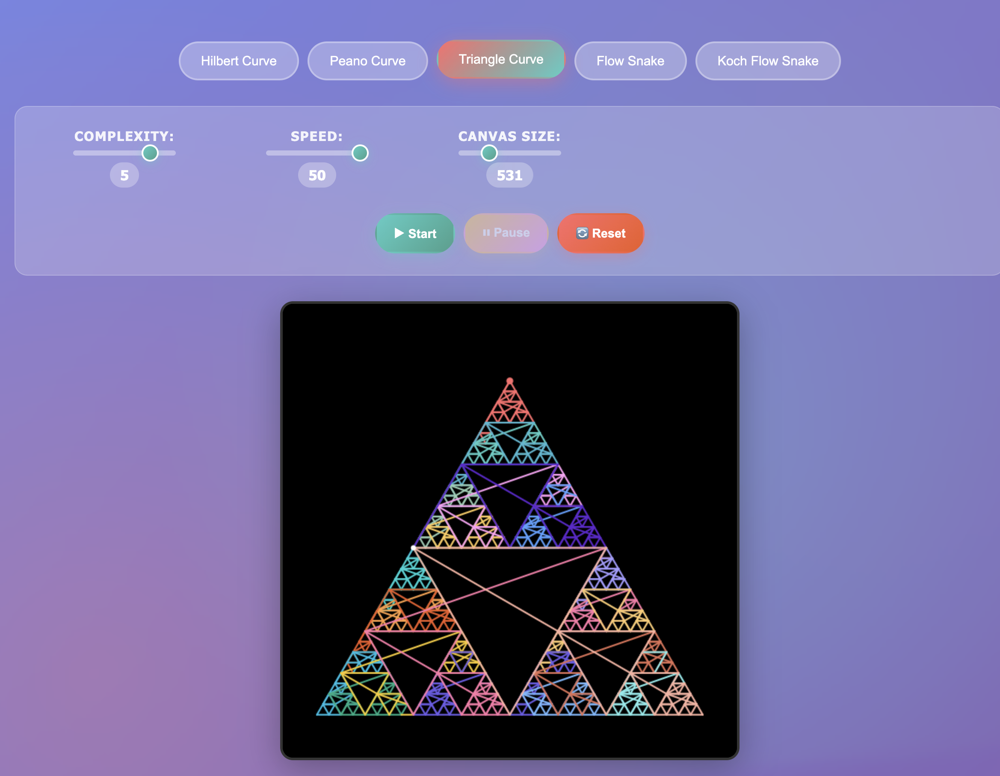

# Space Filling Curves - Interactive Visualization

A comprehensive web application for exploring and visualizing mathematical space-filling curves through interactive animations. This project demonstrates various algorithms that map one-dimensional curves onto two-dimensional spaces, creating fascinating fractal patterns that completely fill geometric regions.



*Interactive visualization of the Triangle Filling Curve demonstrating recursive fractal patterns*

## Features

### Unified Application Architecture
The application provides a single-page interface where all space-filling curves are accessible through tab-based navigation. This design eliminates the need for multiple page loads and allows for instant switching between different curve types while maintaining state and settings.

### Implemented Space-Filling Curves
The application includes five mathematically distinct space-filling curves, each with its own algorithmic approach:

**Hilbert Curve (Orders 1-7)**: Implements David Hilbert's recursive space-partitioning algorithm that divides squares into quadrants and applies rotation transformations to create a continuous path. The algorithm uses bitwise operations and coordinate transformations to efficiently generate points.

**Peano Curve (Orders 1-5)**: Based on Giuseppe Peano's original construction, this curve uses base-3 recursive subdivision with geometric transformations. The implementation handles the complex coordinate mappings required for the nine-subdivision pattern.

**Triangle Filling Curve (Orders 1-6)**: A custom implementation that recursively subdivides triangular regions using midpoint calculations and fractal geometry principles. The algorithm maintains proper connectivity while creating self-similar patterns at multiple scales.

**Flow Snake - Gosper Curve (Orders 1-6)**: Implements the Gosper curve using L-system grammar rules and turtle graphics interpretation. The curve follows the production rules A→A-B--B+A++AA+B- and B→+A-BB--B-A++A+B with 60-degree angle increments.

**Koch Flow Snake (Orders 1-5)**: A hybrid algorithm combining the classic Koch snowflake construction with hexagonal flow patterns. The implementation generates a hexagonal base and applies Koch curve transformations to each edge, then adds internal flow snake patterns.

### Interactive Control System
The interface provides real-time parameter adjustment through several control mechanisms:

- **Complexity Control**: Adjusts the recursion depth for each curve type, with algorithm-specific maximum values to prevent performance issues
- **Animation Speed**: Variable frame-rate control from 1 (detailed, slow) to 50 (rapid overview), affecting the number of curve segments drawn per animation frame
- **Canvas Dimensions**: Dynamic resizing from 400x400 to 900x900 pixels with automatic curve scaling and centering algorithms
- **Playback Controls**: Standard media controls for starting, pausing, and resetting animations with proper state management

### Technical Implementation Features
- **Canvas Rendering**: Utilizes HTML5 Canvas API with requestAnimationFrame for smooth 60fps animations
- **Color Progression**: Implements rainbow gradient mapping across curve segments to visualize drawing progression
- **Responsive Design**: CSS Grid and Flexbox layouts with mobile-optimized breakpoints
- **Performance Optimization**: Efficient point generation algorithms with automatic scaling and centering
- **Memory Management**: Proper cleanup of animation frames and event listeners to prevent memory leaks

## Usage Instructions

### Getting Started
To run the application, open `app.html` in any modern web browser that supports HTML5 Canvas and ES6 JavaScript features. No additional setup or installation is required.

### Operating the Interface
The application interface consists of several key components:

1. **Curve Selection**: Use the navigation tabs at the top to switch between different space-filling curves. Each selection immediately loads the corresponding algorithm and resets the visualization.

2. **Parameter Configuration**: Three main sliders control the visualization:
   - **Complexity**: Determines the recursion depth and level of detail in the curve generation
   - **Speed**: Controls the animation frame rate, affecting how quickly the curve is drawn
   - **Canvas Size**: Adjusts the dimensions of the drawing area and automatically rescales the curve

3. **Animation Control**: Standard playback controls allow you to start, pause, and reset the drawing process. The progress bar indicates completion percentage and current drawing status.

4. **Real-time Feedback**: The interface provides immediate visual feedback for all parameter changes, with automatic curve regeneration and proper state management.

### Default Configuration
The application launches with optimized default settings:
- Animation Speed: 1 (slowest setting for detailed observation)
- Complexity: 5 (high detail level showing intricate patterns)
- Canvas Size: 700x700 pixels (large viewing area for detail appreciation)

## Technical Implementation

### Mathematical Foundations

Each space-filling curve implementation is based on rigorous mathematical principles and computational geometry algorithms:

**Hilbert Curve Algorithm**: The implementation uses a recursive coordinate transformation approach based on Hilbert's original construction. The algorithm employs bitwise operations to determine quadrant positions and applies rotation matrices for proper curve continuity. The space-partitioning method divides the unit square into 2^n × 2^n cells and maps each cell to a position along the curve using a specific ordering that maintains locality.

**Peano Curve Construction**: Built on Giuseppe Peano's base-3 recursive subdivision method. The algorithm divides the unit square into nine equal subsquares and applies geometric transformations including reflections and rotations to maintain curve connectivity. The implementation handles the complex coordinate mapping required for the nine-subdivision pattern while preserving the space-filling property.

**Triangle Subdivision Algorithm**: A custom fractal construction that recursively subdivides equilateral triangles using midpoint calculations. The algorithm maintains proper edge connectivity between recursive levels while creating self-similar patterns. The implementation uses barycentric coordinates and geometric transformations to ensure uniform distribution across the triangular domain.

**L-System Interpretation for Flow Snake**: The Gosper curve implementation follows formal L-system grammar rules with production rules A→A-B--B+A++AA+B- and B→+A-BB--B-A++A+B. The turtle graphics interpreter processes these rules with 60-degree angle increments, creating the characteristic hexagonal tiling pattern. The algorithm uses stack-based state management for proper turtle position and orientation tracking.

**Hybrid Koch-Flow Construction**: Combines traditional Koch snowflake edge replacement rules with internal flow snake patterns. The algorithm first generates a regular hexagon, applies Koch curve transformations to each edge through recursive midpoint displacement, then fills the interior with a scaled flow snake pattern. This creates a complex fractal structure with both boundary and interior detail.

### Rendering and Performance

The visualization system is built on HTML5 Canvas API with several optimization strategies:

- **Frame Management**: Uses requestAnimationFrame for consistent 60fps rendering with automatic fallback for older browsers
- **Point Generation**: Implements efficient algorithms for coordinate calculation with O(n) complexity for most curves
- **Memory Optimization**: Manages point arrays and animation state to prevent memory leaks during curve switching
- **Scaling Algorithms**: Automatic curve scaling and centering based on bounding box calculations to ensure optimal viewport utilization

## Browser Compatibility

The application requires a modern web browser with support for:
- HTML5 Canvas API for 2D graphics rendering
- ECMAScript 6 (ES2015) features including classes, arrow functions, and const/let declarations
- CSS Grid and Flexbox for responsive layout management
- requestAnimationFrame for smooth animation timing

Tested and verified on Chrome 90+, Firefox 88+, Safari 14+, and Edge 90+.

## Project Architecture

### Primary Application Structure
The main application consists of a unified interface with all functionality integrated:

```
app.html                    # Main application entry point
app.js                      # Complete curve algorithms and control logic
app-styles.css              # Modern UI styling with gradient themes
screenshot.png              # Visual application preview
README.md                   # Technical documentation
```

### Legacy Individual Components
The repository also contains individual curve implementations for reference:

```
index.html                  # Original navigation interface
styles.css                  # Original styling system
hilbert.html/hilbert.js     # Standalone Hilbert curve implementation
peano.html/peano.js         # Standalone Peano curve implementation
triangle.html/triangle.js   # Standalone triangle curve implementation
flowsnake.html/flowsnake.js # Standalone flow snake implementation
koch-flowsnake.html/koch-flowsnake.js # Standalone Koch flow snake implementation
```

### Recommended Usage
For the optimal user experience, use the unified application (`app.html`) which provides integrated curve switching, modern UI design, and enhanced performance through shared resources and state management.

## License

This project is open source and available under the MIT License.
